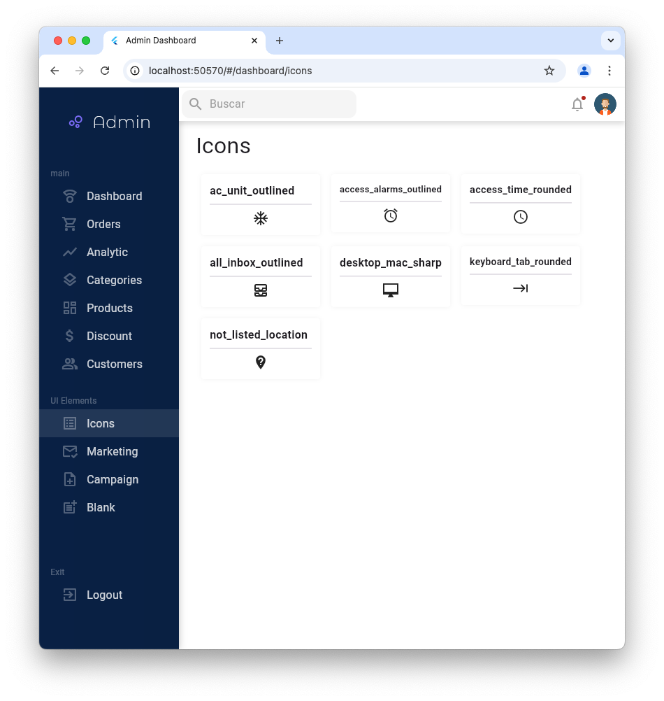
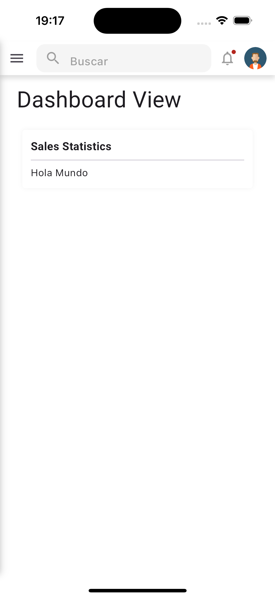
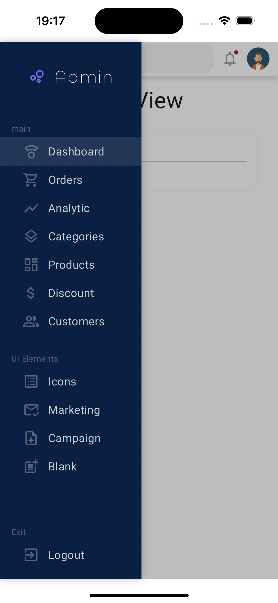

# Admin Dashboard

This is a web-based admin dashboard built with Flutter. The project provides a robust starting point for developing a web admin panel using Flutter's modern UI toolkit.

## Dependencies

This project utilizes several Flutter packages to enhance functionality and ease development:

- [email_validator: ^3.0.0](https://pub.dev/packages/email_validator) - A package to validate email addresses with regular expressions.
- [get_it: ^7.7.0](https://pub.dev/packages/get_it) - A service locator for dependency injection.
- [go_router: ^14.2.7](https://pub.dev/packages/go_router) - A declarative routing package for Flutter apps.
- [google_fonts: ^6.2.1](https://pub.dev/packages/google_fonts) - Provides access to the Google Fonts library.
- [provider: ^6.1.2](https://pub.dev/packages/provider) - A wrapper around InheritedWidget to make it easier to manage state.
- [responsive_framework: ^1.5.1](https://pub.dev/packages/responsive_framework) - A package to make your UI responsive across different screen sizes.
- [shared_preferences: ^2.3.2](https://pub.dev/packages/shared_preferences) - A simple key-value pair storage for persistent data across app restarts.

## Branch Information

If you're starting a new project based on this admin dashboard, it is recommended to start from the `base_dashboard` branch. This branch provides the most stable and basic structure, ideal for kicking off your own customizations and features.

## Assets

This project includes various images stored in the `assets/images/` directory. Below are the images and their respective paths:

- **Desktop Images:**
  - 

- **Mobile Images:**
  

  
  
  

